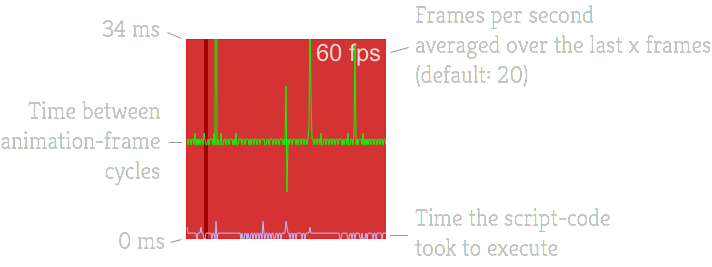

famous-lagometer
==========

Lagometer for famo.us showing the FPS, animation-frames times and script times.



### [View the demo here](https://rawgit.com/IjzerenHein/famous-lagometer/master/examples/demo/index.html)


## Getting started

Install using bower or npm:

    bower install famous-lagometer

    npm install famous-lagometer

Create lagometer:

```javascript
var Lagometer = require('famous-lagometer/Lagometer');

var modifier = new Modifier({
    size: [100, 100],
    align: [1.0, 0.0],
    origin: [1.0, 0.0],
    transform: Transform.translate(-10, 10, 0)
});
var lagometer = new Lagometer({
    size: modifier.getSize() // required
});
this.add(modifier).add(lagometer);
```

## Constructor options

Options that you can configure through the constructor:

```javascript
{
    size: [100, 100],   // size, required!
    drawFrequency: 2,   // by default 2 times per second
    min: 0,             // minimum scale
    max: 34,            // max scale
    backgroundColor: 'rgba(200, 0, 0, 0.8)',
    borderColor: 'rgba(255, 0, 0, 0.8)',
    textColor: 'rgba(255, 255, 255, 0.8)',
    font: '28px Arial',
    frameColor: '#00FF00',
    scriptColor: '#BBBBFF'
};
```

## Contribute

If you like this project and want to support it, show some love and give it a star.

## Contact
- 	@IjzerenHein
- 	http://www.gloey.nl
- 	hrutjes@gmail.com (for hire)

© 2014/2015 - Hein Rutjes
