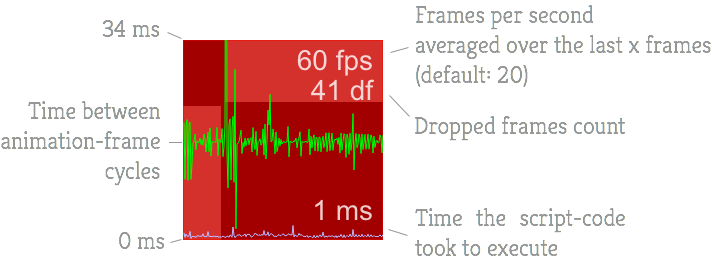

famous-lagometer
==========

Lagometer for famo.us showing the FPS, animation-frames times and script times.



## Demo

[View the demo here](https://rawgit.com/IjzerenHein/famous-lagometer/master/examples/demo/index.html)


## Getting started

Install using bower:
	
	bower install IjzerenHein/famous-lagometer
	
Add famous-lagometer to the requirejs paths config if neccessary:

```javascript
require.config({
    paths: {
        ...
        'famous-lagometer': 'bower_components/famous-lagometer/Lagometer',
        ...
    }
});
```

Create lagometer:

```javascript
var Lagometer = require('famous-lagometer');

var modifier = new Modifier({
    size: [100, 100],
    align: [1.0, 0.0],
    origin: [1.0, 0.0],
    transform: Transform.translate(-10, 10, 0)
});
var lagometer = new Lagometer({
    size: modifier.getSize()
});
this.add(modifier).add(lagometer);
```

## Constructor options

```javascript
{
    size: [100, 100],
    min: 0,
    max: 34,
    backgroundColor: 'rgba(200, 0, 0, 0.8)',
    borderColor: 'rgba(255, 0, 0, 0.8)',
    textColor: 'rgba(255, 255, 255, 0.8)',
    font: '28px Arial',
    frameColor: '#00FF00',
    scriptColor: '#BBBBFF'
};
```

## Contribute

Feel free to contribute to this project in any way. The easiest way to support this project is by giving it a star.

## Contact
- 	@IjzerenHein
- 	http://www.gloey.nl
- 	hrutjes@gmail.com

© 2014 - Hein Rutjes